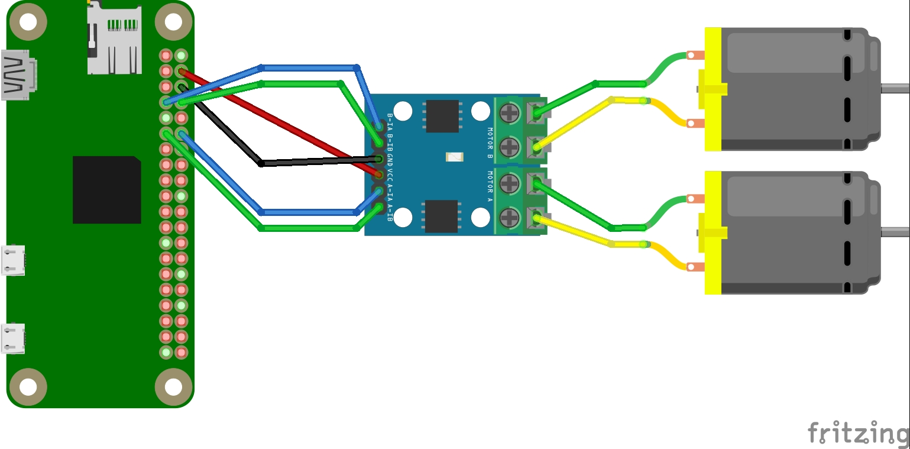

# gpiozero-mqtt-robot
 This project aims to show how to create some remote controlled robot using Raspberry Pi and MQTT.

## Development notes
This project has been generated with [this cookiecutter template](https://github.com/jazumaquero/python_template), so,
take following points into account:

* This project has been build for Python 3.8.
* This project uses [poetry](https://python-poetry.org/) for building and dependency management.
* Poetry has been configured in order to use some virtual environment at this project directory named *.venv*.
* Project is configured to use *pytest* for running tests and *coverage* to obtain code coverage.
* Testing and coverage reports are stored into reports folder

## Introduction
Let's start with some naive approach:** building some so simple robot that will be remotely controlled with simple
commands**. This approach may seem extremely simple, but can be use as a foundation for an incremental development of a
more complex robot, allowing us to explore all concepts behind a robot creation. Furthermore, this will allow us to
consider not only how to code each function, but also will give us some insights about what architecture requirements
will be needed to make reliable any robot.

As I have mentioned before, main objective is *play and learn*, so that, we won't require so much precision, neither an
awesome speed, what lead this project into a lean implementation.

## Architecture
### Hardware
In principle, we want to minimize how many components we're using (following lean principles), so that we will use some
**Raspberry PI**, in my case some *Raspberry Pi Zero W*, but a *Raspberry Pi 3/4* with WiFi will work fine too.

On the other hand, we will consider a mobile robot based on a differential motor, so that, our bill of materials will
include:

* Raspberry Pi Zero W.
* 2 x DC motors.
* 1 x H-Bridge (something cheap like a L9110 will be fine).

### Communications
Initially, we will consider that our robot will accept command in some RPC fashion, so that, we can modify our robot
behavior remotely just sending some messages (command) and checking the response. On the other hand, we may eventually
require having extra information about our robot (state change, sensor measures, etc.), so that, we may need to listen
generated message.

In order to make simpler and reliable communications some message-broker will be used. Furthermore, keep working on a
lean approach, *MQTT* seems some good candidate due to low requirements and reduced overhead.
